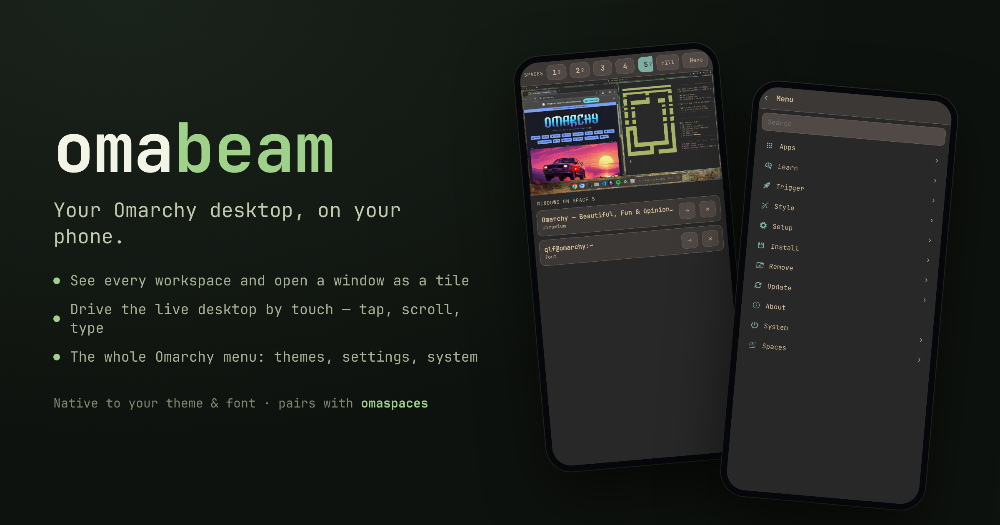
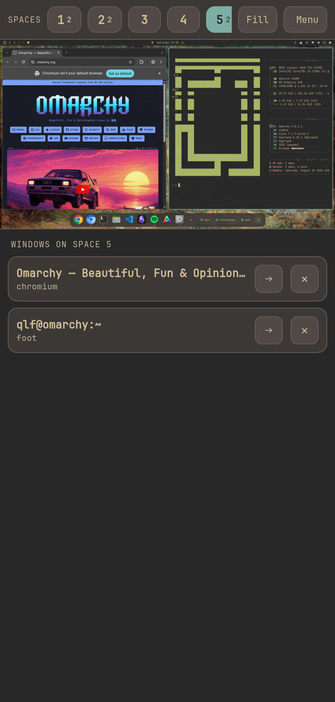
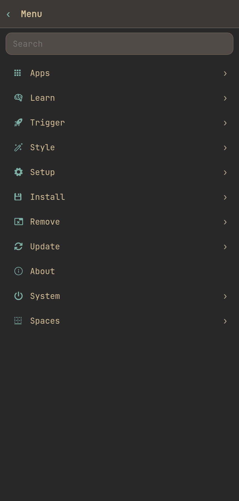
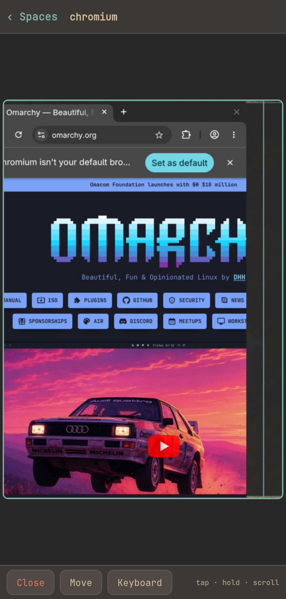

# omabeam

**Your Omarchy desktop, on your phone.**



omabeam turns any phone into a live remote for an Omarchy machine: see your
workspaces, open a window as a full-screen tile, drive the whole desktop by
touch, and reach the entire Omarchy menu — themes, backgrounds, settings,
system — from the same screen. It renders in your current theme and font, so
it feels like the desktop, not a web page.

## What it does

- **Workspaces** — switch spaces, see what's on each one by window title.
- **Windows** — tap a window to open it as a portrait tile you can tap, scroll,
  and type into; move it to another space or close it from the phone.
- **Full control** — drive the entire live desktop by touch, with an on-screen
  keyboard that has Ctrl / Alt / Super for any Hyprland keybinding.
- **The Omarchy menu** — the real menu (Apps, Learn, Trigger, Style, Setup,
  Install, Remove, Update, System), parsed from your own menu files and run with
  the same commands. Themes and backgrounds apply straight from the phone.

## Screens

| Home | Menu | Window tile |
|---|---|---|
|  |  |  |

## Works with omaspaces

[omaspaces](https://github.com/qlfahey/omaspaces) is a separate tool — a window
layout builder and dock for Omarchy. If it's installed, omabeam adds a **Spaces**
section that opens and saves your omaspaces layouts. omabeam works fine without
it; the section just won't appear.

## Install

Omarchy / Arch — the installer resolves dependencies, installs into `~/.local`
(no root for the app itself), and sets up input access:

```bash
git clone https://github.com/qlfahey/omabeam.git
cd omabeam
./install-omarchy
```

**Prebuilt package** (installs system-wide, pulls dependencies):

```bash
sudo pacman -U https://github.com/qlfahey/omabeam/releases/download/v0.3.1/omabeam-0.3.1-1-any.pkg.tar.zst
```

Or build it yourself with `makepkg -si` (see [PKGBUILD](PKGBUILD)). AUR
submission is prepared (`./publish-aur.sh`) and coming soon.

Dependencies: `python`, `grim`, `ydotool`, `wtype`, `hyprland`, `jq`.
Optional: `cloudflared` (public URL), `qrencode` (terminal QR), `omaspaces` (layouts).

Input access is one-time: `ydotoold` needs `/dev/uinput` and your user must be in
the `input` group. `./install-omarchy` does this for you (a udev rule + group add;
log out and back in once). The prebuilt package prints the same steps.

## Use

```bash
omabeam            # start and show a secure link that works ANYWHERE (+ QR)
omabeam qr         # reprint the current link + QR
omabeam url        # print the current link
omabeam lan        # local network only (no public link)
omabeam rotate     # revoke the current link (new token) and restart fresh
omabeam stop       # stop the server
```

**One command, works anywhere.** Run `omabeam`, scan the QR, and your phone
controls the desktop from any network — home, cell, a café. It fetches
`cloudflared` on first run if needed and stands up a token-protected HTTPS link;
no accounts, no port forwarding, no VPN. When a device connects you get a desktop
notification, and `omabeam rotate` instantly kills the link and mints a new one.

**Stay local instead:** `omabeam lan` serves only on your own network, never the
internet.

### A permanent link (static URL)

A free throwaway tunnel gets a new URL each run. For a link you can bookmark once
and reuse forever, run `omabeam setup` and pick one:

- **ngrok** (recommended, free) — ngrok's free tier includes one reserved domain
  (`name.ngrok-free.app`). `omabeam setup` fetches ngrok, saves your authtoken and
  domain, and from then on `omabeam` serves `https://name.ngrok-free.app/?t=…`
  every time.
- **Cloudflare named tunnel** — a hostname on a domain you own
  (`beam.yourdomain.com`). `omabeam setup` prints the one-time `cloudflared`
  steps; set `TUNNEL_TOKEN` and `TUNNEL_HOSTNAME` and omabeam uses your hostname.

Config lives in `~/.config/omabeam/config` (or set `OMABEAM_NGROK_DOMAIN` /
`OMABEAM_TUNNEL_TOKEN` in the environment). Either way the address is stable, so
you scan the QR once. Without setup, keep omabeam running to hold a temporary URL.

## How it works

A small Python server captures the screen with `grim` (streamed as MJPEG),
reports window and workspace state from `hyprctl`, and turns touches into real
input with `ydotool` and `wtype`. The menu is read from Omarchy's own
`omarchy-menu.jsonc` and executed with the same shell actions, so it always
matches the desktop.

## Security

omabeam is a remote for your whole desktop, so its access model is deliberate:

- **The link is the key.** It carries a 128-bit random token, checked in constant
  time on every request, over the tunnel's HTTPS. **Treat the link like a
  password** — don't post it or paste it where it gets logged.
- **Revoke instantly.** `omabeam rotate` mints a new token and kills every old
  link. Rotate if a link ever leaks, or just when you're done for the day.
- **You see every connection.** The first request from any device pops a desktop
  notification, so an unexpected connection is impossible to miss.
- **Public only while it's running.** The link exists only while `omabeam` runs;
  stop it (or `omabeam stop`) and there's nothing to reach. For local-only use,
  `omabeam lan` never touches the internet at all.
- **A permanent address stays yours.** `OMABEAM_TUNNEL_TOKEN` routes through a
  Cloudflare tunnel you own, so the hostname is under your control rather than a
  shared throwaway domain.
- **No arbitrary execution from the phone.** The menu runs Omarchy's own commands
  read from your menu files; touch and keys go through `ydotool`/`wtype`. The
  server serves no files by path and takes no shell strings from the client.

## License

MIT. See [LICENSE](LICENSE).

Not affiliated with Omarchy; a community tool in the spirit of "build your own
OS."
